# Dependency Graph — Pet Echo

**Slice 46** — Reference only. Shows build order and hard dependencies between slices. Not an executable slice.

Source: `PETTU_BUILD_SPEC.md` Slice 46.

---

## Graph

```mermaid
flowchart TD
  CONTRACT[CONTRACT] --> REPO[REPO]
  REPO --> EXPO[EXPO]
  EXPO --> SUPABASE[SUPABASE]
  SUPABASE --> DB[DB]
  DB --> RLS[RLS]
  RLS --> STORAGE[STORAGE]
  STORAGE --> AUTH[AUTH]
  AUTH --> ENGINE[COMPANION ENGINE]
  ENGINE --> CARE[CARE ENGINE]
  CARE --> TIME[TIME ENGINE]
  TIME --> ONBOARD[ONBOARDING]
  ONBOARD --> PHOTO[PHOTO PIPELINE]
  PHOTO --> AIJOBS[AI JOBS]
  AIJOBS --> GEN[GENERATION]
  GEN --> HOME[HOME]
  HOME --> MOOD[MOOD]
  MOOD --> DIALOGUE[DIALOGUE]
  DIALOGUE --> MEM[MEMORIES]
  MEM --> RECAP[RECAPS]
  RECAP --> PAWS[PAW POINTS]
  PAWS --> COS[COSMETICS]
  COS --> ENT[ENTITLEMENTS]
  ENT --> PAY[PAYMENTS]
  PAY --> FAMILY[FAMILY CARE]
  FAMILY --> NOTIF[NOTIFICATIONS]
  NOTIF --> DEL[DELETION]
  DEL --> ANALYTICS[ANALYTICS]
  ANALYTICS --> OBS[OBSERVABILITY]
  OBS --> SEC[SECURITY TEST]
  SEC --> E2E[E2E]
  E2E --> BETA[BETA]
  BETA --> STORE[STORE]
  STORE --> PROD[PRODUCTION]
  PROD --> MON[MONITORING]
```



---

## Linear reference (ASCII)

```
CONTRACT → REPO → EXPO → SUPABASE → DB → RLS → STORAGE → AUTH
→ COMPANION ENGINE → CARE ENGINE → TIME ENGINE → ONBOARDING
→ PHOTO PIPELINE → AI JOBS → GENERATION → HOME → MOOD → DIALOGUE
→ MEMORIES → RECAPS → PAW POINTS → COSMETICS → ENTITLEMENTS
→ PAYMENTS → FAMILY CARE → NOTIFICATIONS → DELETION → ANALYTICS
→ OBSERVABILITY → SECURITY TEST → E2E → BETA → STORE → PRODUCTION → MONITORING
```

---

## Critical path notes

| Node | Blocks |
|------|--------|
| RLS (06) | All multi-tenant reads/writes |
| Companion engine (09) | Mood, care, time engine |
| Idempotency (12) | Payments, care replay, generation |
| Security test (34–35) | Beta, production gate |
| Persistence gate (38) | Production gate |
| EAS compile gate (02A–02D) | Native Android verification |

---

## Slice map (01–46)

| Phase | Slices | Topic |
|-------|--------|-------|
| Control | 01–02 | Docs, repo, Android compile gate 02A–02D |
| Foundation | 03–08 | Env, nav, auth, RLS, schema, storage |
| Engine | 09–12 | Companion, care, time, idempotency |
| Onboarding & AI | 13–19 | Photos, jobs, generation, reveal |
| Core UX | 20–24 | Home, mood, dialogue, memories, recaps |
| Economy | 25–29 | Paw Points, shop, entitlements, payments, family |
| Account | 30–32 | Notifications, profile, deletion |
| Observability | 33 | Analytics, Sentry, PostHog |
| Hardening | 34–39 | Security, idempotency, AI failure, offline, persistence, perf |
| Launch | 40–46 | A11y, device matrix, beta, readiness, store, post-launch, this graph |

See `PROJECT_STATE.md` for current completion status.
